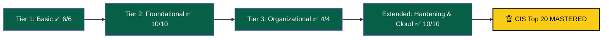

<div align="center">


<a href="https://git.io/typing-svg">
  
</a>


</div>

---

## 🛡️ About This Repository

This repository documents the **complete, hands-on mastery** of the **CIS Top 20 Critical Security Controls** — the industry-standard framework security teams use as their baseline defense playbook. All **30 labs** (the official 20 controls + 10 applied hardening/cloud extensions) have been **completed** on the [Alnafi LMS](https://apps.lms.alnafi.com/), from day-one asset inventory to full-system hardening, encryption, and incident response.

> 💡 **Why it matters:** Knowing *what's on your network* is step one. Knowing *how to protect, detect, and respond* is what turns that inventory into an actual security program. This track walks the entire arc — Basic → Foundational → Organizational → Applied.

<div align="center">

**Overall Progress**


</div>

```bash
$ ./run_cis_audit.sh --track "CIS Top 20 Controls"

[✔] Tier 1 — Basic Controls .................... 6/6   COMPLETE
[✔] Tier 2 — Foundational Controls .............. 10/10 COMPLETE
[✔] Tier 3 — Organizational Controls ............ 4/4   COMPLETE
[✔] Extended — Hardening & Cloud Security ....... 10/10 COMPLETE
──────────────────────────────────────────────────────────────
[✔] TOTAL ........................................ 30/30  ✅ 100%

>>> Framework status: FULLY IMPLEMENTED
```

---

## ✅ Completed Labs — Full Checklist

### 🟢 Tier 1 — Basic Controls (CIS 1–6)
> *Know your assets, know your gaps, control your admins.*
**Status: 6 / 6 Complete ✅**

- [x] [1. Hardware Asset Inventory](https://apps.lms.alnafi.com/learning/course/course-v1:alnafi+dccs-basic-labs-25+dccs-basic-labs-2025/block-v1:alnafi+dccs-basic-labs-25+dccs-basic-labs-2025+type@sequential+block@sequential4/block-v1:alnafi+dccs-basic-labs-25+dccs-basic-labs-2025+type@vertical+block@vertical231)
- [x] [2. Software Asset Inventory](https://apps.lms.alnafi.com/learning/course/course-v1:alnafi+dccs-basic-labs-25+dccs-basic-labs-2025/block-v1:alnafi+dccs-basic-labs-25+dccs-basic-labs-2025+type@sequential+block@sequential4/block-v1:alnafi+dccs-basic-labs-25+dccs-basic-labs-2025+type@vertical+block@vertical232)
- [x] [3. Basic Vulnerability Scanning](https://apps.lms.alnafi.com/learning/course/course-v1:alnafi+dccs-basic-labs-25+dccs-basic-labs-2025/block-v1:alnafi+dccs-basic-labs-25+dccs-basic-labs-2025+type@sequential+block@sequential4/block-v1:alnafi+dccs-basic-labs-25+dccs-basic-labs-2025+type@vertical+block@vertical233)
- [x] [4. Controlled Use of Administrative Privileges](https://apps.lms.alnafi.com/learning/course/course-v1:alnafi+dccs-basic-labs-25+dccs-basic-labs-2025/block-v1:alnafi+dccs-basic-labs-25+dccs-basic-labs-2025+type@sequential+block@sequential4/block-v1:alnafi+dccs-basic-labs-25+dccs-basic-labs-2025+type@vertical+block@vertical234)
- [x] [5. Secure Configuration for Endpoints](https://apps.lms.alnafi.com/learning/course/course-v1:alnafi+dccs-basic-labs-25+dccs-basic-labs-2025/block-v1:alnafi+dccs-basic-labs-25+dccs-basic-labs-2025+type@sequential+block@sequential4/block-v1:alnafi+dccs-basic-labs-25+dccs-basic-labs-2025+type@vertical+block@vertical235)
- [x] [6. Monitoring & Analysis of Audit Logs](https://apps.lms.alnafi.com/learning/course/course-v1:alnafi+dccs-basic-labs-25+dccs-basic-labs-2025/block-v1:alnafi+dccs-basic-labs-25+dccs-basic-labs-2025+type@sequential+block@sequential4/block-v1:alnafi+dccs-basic-labs-25+dccs-basic-labs-2025+type@vertical+block@vertical236)

<br>

### 🟡 Tier 2 — Foundational Controls (CIS 7–16)
> *Harden the perimeter, contain the blast radius.*
**Status: 10 / 10 Complete ✅**

- [x] [7. Securing Email & Web Browsers](https://apps.lms.alnafi.com/learning/course/course-v1:alnafi+dccs-basic-labs-25+dccs-basic-labs-2025/block-v1:alnafi+dccs-basic-labs-25+dccs-basic-labs-2025+type@sequential+block@sequential4/block-v1:alnafi+dccs-basic-labs-25+dccs-basic-labs-2025+type@vertical+block@vertical237)
- [x] [8. Malware Defenses](https://apps.lms.alnafi.com/learning/course/course-v1:alnafi+dccs-basic-labs-25+dccs-basic-labs-2025/block-v1:alnafi+dccs-basic-labs-25+dccs-basic-labs-2025+type@sequential+block@sequential4/block-v1:alnafi+dccs-basic-labs-25+dccs-basic-labs-2025+type@vertical+block@vertical238)
- [x] [9. Limiting Network Ports, Protocols, & Services](https://apps.lms.alnafi.com/learning/course/course-v1:alnafi+dccs-basic-labs-25+dccs-basic-labs-2025/block-v1:alnafi+dccs-basic-labs-25+dccs-basic-labs-2025+type@sequential+block@sequential4/block-v1:alnafi+dccs-basic-labs-25+dccs-basic-labs-2025+type@vertical+block@vertical239)
- [x] [10. Data Recovery Capabilities](https://apps.lms.alnafi.com/learning/course/course-v1:alnafi+dccs-basic-labs-25+dccs-basic-labs-2025/block-v1:alnafi+dccs-basic-labs-25+dccs-basic-labs-2025+type@sequential+block@sequential4/block-v1:alnafi+dccs-basic-labs-25+dccs-basic-labs-2025+type@vertical+block@vertical240)
- [x] [11. Secure Configuration for Network Devices](https://apps.lms.alnafi.com/learning/course/course-v1:alnafi+dccs-basic-labs-25+dccs-basic-labs-2025/block-v1:alnafi+dccs-basic-labs-25+dccs-basic-labs-2025+type@sequential+block@sequential4/block-v1:alnafi+dccs-basic-labs-25+dccs-basic-labs-2025+type@vertical+block@vertical241)
- [x] [12. Boundary Defense](https://apps.lms.alnafi.com/learning/course/course-v1:alnafi+dccs-basic-labs-25+dccs-basic-labs-2025/block-v1:alnafi+dccs-basic-labs-25+dccs-basic-labs-2025+type@sequential+block@sequential4/block-v1:alnafi+dccs-basic-labs-25+dccs-basic-labs-2025+type@vertical+block@vertical242)
- [x] [13. Data Protection Basics](https://apps.lms.alnafi.com/learning/course/course-v1:alnafi+dccs-basic-labs-25+dccs-basic-labs-2025/block-v1:alnafi+dccs-basic-labs-25+dccs-basic-labs-2025+type@sequential+block@sequential4/block-v1:alnafi+dccs-basic-labs-25+dccs-basic-labs-2025+type@vertical+block@vertical243)
- [x] [14. Controlled Access Based on Need to Know](https://apps.lms.alnafi.com/learning/course/course-v1:alnafi+dccs-basic-labs-25+dccs-basic-labs-2025/block-v1:alnafi+dccs-basic-labs-25+dccs-basic-labs-2025+type@sequential+block@sequential4/block-v1:alnafi+dccs-basic-labs-25+dccs-basic-labs-2025+type@vertical+block@vertical244)
- [x] [15. Wireless Access Control](https://apps.lms.alnafi.com/learning/course/course-v1:alnafi+dccs-basic-labs-25+dccs-basic-labs-2025/block-v1:alnafi+dccs-basic-labs-25+dccs-basic-labs-2025+type@sequential+block@sequential4/block-v1:alnafi+dccs-basic-labs-25+dccs-basic-labs-2025+type@vertical+block@vertical245)
- [x] [16. Account Monitoring & Control](https://apps.lms.alnafi.com/learning/course/course-v1:alnafi+dccs-basic-labs-25+dccs-basic-labs-2025/block-v1:alnafi+dccs-basic-labs-25+dccs-basic-labs-2025+type@sequential+block@sequential4/block-v1:alnafi+dccs-basic-labs-25+dccs-basic-labs-2025+type@vertical+block@vertical246)

<br>

### 🔴 Tier 3 — Organizational Controls (CIS 17–20)
> *People, process, and proving your defenses actually work.*
**Status: 4 / 4 Complete ✅**

- [x] [17. Security Awareness Training](https://apps.lms.alnafi.com/learning/course/course-v1:alnafi+dccs-basic-labs-25+dccs-basic-labs-2025/block-v1:alnafi+dccs-basic-labs-25+dccs-basic-labs-2025+type@sequential+block@sequential4/block-v1:alnafi+dccs-basic-labs-25+dccs-basic-labs-2025+type@vertical+block@vertical247)
- [x] [18. Application Software Security](https://apps.lms.alnafi.com/learning/course/course-v1:alnafi+dccs-basic-labs-25+dccs-basic-labs-2025/block-v1:alnafi+dccs-basic-labs-25+dccs-basic-labs-2025+type@sequential+block@sequential4/block-v1:alnafi+dccs-basic-labs-25+dccs-basic-labs-2025+type@vertical+block@vertical248)
- [x] [19. Incident Response & Management](https://apps.lms.alnafi.com/learning/course/course-v1:alnafi+dccs-basic-labs-25+dccs-basic-labs-2025/block-v1:alnafi+dccs-basic-labs-25+dccs-basic-labs-2025+type@sequential+block@sequential4/block-v1:alnafi+dccs-basic-labs-25+dccs-basic-labs-2025+type@vertical+block@vertical249)
- [x] [20. Penetration Testing & Red Team Exercises](https://apps.lms.alnafi.com/learning/course/course-v1:alnafi+dccs-basic-labs-25+dccs-basic-labs-2025/block-v1:alnafi+dccs-basic-labs-25+dccs-basic-labs-2025+type@sequential+block@sequential4/block-v1:alnafi+dccs-basic-labs-25+dccs-basic-labs-2025+type@vertical+block@vertical250)

<br>

### ⚫ Extended Track — Applied Hardening & Cloud Security (21–30)
> *Beyond the official 20 — real-world hardening across OS, cloud, and crypto.*
**Status: 10 / 10 Complete ✅**

- [x] [21. Patch Management Basics](https://apps.lms.alnafi.com/learning/course/course-v1:alnafi+dccs-basic-labs-25+dccs-basic-labs-2025/block-v1:alnafi+dccs-basic-labs-25+dccs-basic-labs-2025+type@sequential+block@sequential4/block-v1:alnafi+dccs-basic-labs-25+dccs-basic-labs-2025+type@vertical+block@vertical251)
- [x] [22. Hardening a Windows System](https://apps.lms.alnafi.com/learning/course/course-v1:alnafi+dccs-basic-labs-25+dccs-basic-labs-2025/block-v1:alnafi+dccs-basic-labs-25+dccs-basic-labs-2025+type@sequential+block@sequential4/block-v1:alnafi+dccs-basic-labs-25+dccs-basic-labs-2025+type@vertical+block@vertical252)
- [x] [23. Hardening a Linux System](https://apps.lms.alnafi.com/learning/course/course-v1:alnafi+dccs-basic-labs-25+dccs-basic-labs-2025/block-v1:alnafi+dccs-basic-labs-25+dccs-basic-labs-2025+type@sequential+block@sequential4/block-v1:alnafi+dccs-basic-labs-25+dccs-basic-labs-2025+type@vertical+block@vertical253)
- [x] [24. SIEM Integration for Logs](https://apps.lms.alnafi.com/learning/course/course-v1:alnafi+dccs-basic-labs-25+dccs-basic-labs-2025/block-v1:alnafi+dccs-basic-labs-25+dccs-basic-labs-2025+type@sequential+block@sequential4/block-v1:alnafi+dccs-basic-labs-25+dccs-basic-labs-2025+type@vertical+block@vertical254)
- [x] [25. Secure Cloud Instance (Basic)](https://apps.lms.alnafi.com/learning/course/course-v1:alnafi+dccs-basic-labs-25+dccs-basic-labs-2025/block-v1:alnafi+dccs-basic-labs-25+dccs-basic-labs-2025+type@sequential+block@sequential4/block-v1:alnafi+dccs-basic-labs-25+dccs-basic-labs-2025+type@vertical+block@vertical255)
- [x] [26. Endpoint Security Tool Introduction](https://apps.lms.alnafi.com/learning/course/course-v1:alnafi+dccs-basic-labs-25+dccs-basic-labs-2025/block-v1:alnafi+dccs-basic-labs-25+dccs-basic-labs-2025+type@sequential+block@sequential4/block-v1:alnafi+dccs-basic-labs-25+dccs-basic-labs-2025+type@vertical+block@vertical256)
- [x] [27. Data at Rest Encryption](https://apps.lms.alnafi.com/learning/course/course-v1:alnafi+dccs-basic-labs-25+dccs-basic-labs-2025/block-v1:alnafi+dccs-basic-labs-25+dccs-basic-labs-2025+type@sequential+block@sequential4/block-v1:alnafi+dccs-basic-labs-25+dccs-basic-labs-2025+type@vertical+block@vertical257)
- [x] [28. Data in Transit Encryption](https://apps.lms.alnafi.com/learning/course/course-v1:alnafi+dccs-basic-labs-25+dccs-basic-labs-2025/block-v1:alnafi+dccs-basic-labs-25+dccs-basic-labs-2025+type@sequential+block@sequential4/block-v1:alnafi+dccs-basic-labs-25+dccs-basic-labs-2025+type@vertical+block@vertical258)
- [x] [29. Verifying Backups](https://apps.lms.alnafi.com/learning/course/course-v1:alnafi+dccs-basic-labs-25+dccs-basic-labs-2025/block-v1:alnafi+dccs-basic-labs-25+dccs-basic-labs-2025+type@sequential+block@sequential4/block-v1:alnafi+dccs-basic-labs-25+dccs-basic-labs-2025+type@vertical+block@vertical259)
- [x] [30. Strengthening Password & Account Policies](https://apps.lms.alnafi.com/learning/course/course-v1:alnafi+dccs-basic-labs-25+dccs-basic-labs-2025/block-v1:alnafi+dccs-basic-labs-25+dccs-basic-labs-2025+type@sequential+block@sequential4/block-v1:alnafi+dccs-basic-labs-25+dccs-basic-labs-2025+type@vertical+block@vertical260)

---

## 🗺️ Framework Roadmap — Fully Cleared



---

## 🧰 Skills Unlocked

<div align="center">

| 🗂️ Asset & Vuln Mgmt | 🔐 Access Control | 🌐 Network Defense | 🧯 Resilience | ⚫ Applied Hardening |
|:---:|:---:|:---:|:---:|:---:|
| Hardware/software inventory | Admin privilege control | Boundary defense | Data recovery | Windows & Linux hardening |
| Vulnerability scanning | Need-to-know access | Network device config | Audit log monitoring | Encryption (rest & transit) |
| Patch management | Wireless access control | Email/browser protection | Backup verification | SIEM, cloud & endpoint security |
| Security awareness | Account monitoring | Malware defenses | Incident response | Red team exercises |

</div>

---

## 🏆 Final Status

<div align="center">


```diff
+ Tier 1 — Basic Controls .................... 6/6   ✅
+ Tier 2 — Foundational Controls .............. 10/10 ✅
+ Tier 3 — Organizational Controls ............ 4/4   ✅
+ Extended — Hardening & Cloud Security ....... 10/10 ✅
──────────────────────────────────────────────────────
+ TOTAL: 30/30 Labs — 100% COMPLETE
+ Framework: CIS Critical Security Controls
+ Provider: Alnafi LMS
```

</div>

---

<div align="center">

### 🕵️ Every Control Implemented. Every Gap Closed.

*From asset inventory to red team exercises — the full defensive lifecycle, hands-on.*


</div>
