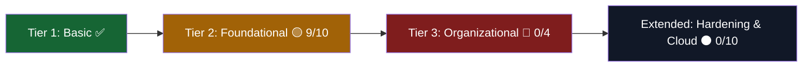

<div align="center">


</div>

---

## 🛡️ About This Repository

This repository tracks my **security & compliance** learning path — split into two tracks:

1. **Elasticsearch Threat Hunting and Observability Engineer** — ✅ **Completed** end-to-end.
2. **CIS Top 20 Critical Security Controls** — a 30-lab hands-on track implementing the industry-standard CIS Controls framework, currently **in progress**.

> 💡 **Why CIS Top 20?** These are the controls security teams around the world use as a baseline defense framework — from knowing *what's on your network* (asset inventory) to *how you'd respond when it breaks* (incident response & red teaming). Working through them hands-on builds real blue-team muscle memory, not just theory.

I believe in **honest progress tracking** — the checklist below reflects exactly what's done and what's still ahead. No inflated numbers.

---

## 📊 Live Progress Dashboard

<div align="center">

| Track | Completed | Status |
|:--|:--:|:--:|
| 🔎 **Elasticsearch Threat Hunting & Observability** | 100% | ✅ Completed |
| 🛡️ **CIS Top 20 Controls Labs** | 15 / 30 | 🟡 In Progress |

**CIS Labs Progress:** `[███████████████████████░░░░░░░░░░░░░░░░░░░░░] 50%`

</div>

```bash
$ whoami --track security
> Elasticsearch Threat Hunting & Observability Engineer ......... [DONE]
> CIS Top 20 Controls ............................................ [15/30]
> Next target: Account Monitoring & Control (Control #16)
```

---

## 🎓 Track 1 — Elasticsearch Threat Hunting and Observability Engineer

```diff
+ Status: Completed ✅
+ Focus: Detection engineering, log analytics, observability pipelines,
+        and threat hunting workflows built on the Elastic Stack
```

<div align="center">


</div>

---

## 🛡️ Track 2 — CIS Top 20 Critical Security Controls

The CIS Controls are grouped into three tiers — **Basic**, **Foundational**, and **Organizational** — plus an **Extended Hardening & Cloud** set of applied labs. Here's exactly where I stand in each.

### 🟢 Tier 1 — Basic Controls (CIS 1–6)
> *Know your assets, know your gaps, control your admins.*
**Status: 6 / 6 Complete ✅**

- [x] [1. Hardware Asset Inventory](https://apps.lms.alnafi.com/learning/course/course-v1:alnafi+dccs-basic-labs-25+dccs-basic-labs-2025/block-v1:alnafi+dccs-basic-labs-25+dccs-basic-labs-2025+type@sequential+block@sequential4/block-v1:alnafi+dccs-basic-labs-25+dccs-basic-labs-2025+type@vertical+block@vertical231)
- [x] [2. Software Asset Inventory](https://apps.lms.alnafi.com/learning/course/course-v1:alnafi+dccs-basic-labs-25+dccs-basic-labs-2025/block-v1:alnafi+dccs-basic-labs-25+dccs-basic-labs-2025+type@sequential+block@sequential4/block-v1:alnafi+dccs-basic-labs-25+dccs-basic-labs-2025+type@vertical+block@vertical232)
- [x] [3. Basic Vulnerability Scanning](https://apps.lms.alnafi.com/learning/course/course-v1:alnafi+dccs-basic-labs-25+dccs-basic-labs-2025/block-v1:alnafi+dccs-basic-labs-25+dccs-basic-labs-2025+type@sequential+block@sequential4/block-v1:alnafi+dccs-basic-labs-25+dccs-basic-labs-2025+type@vertical+block@vertical233)
- [x] [4. Controlled Use of Administrative Privileges](https://apps.lms.alnafi.com/learning/course/course-v1:alnafi+dccs-basic-labs-25+dccs-basic-labs-2025/block-v1:alnafi+dccs-basic-labs-25+dccs-basic-labs-2025+type@sequential+block@sequential4/block-v1:alnafi+dccs-basic-labs-25+dccs-basic-labs-2025+type@vertical+block@vertical234)
- [x] [5. Secure Configuration for Endpoints](https://apps.lms.alnafi.com/learning/course/course-v1:alnafi+dccs-basic-labs-25+dccs-basic-labs-2025/block-v1:alnafi+dccs-basic-labs-25+dccs-basic-labs-2025+type@sequential+block@sequential4/block-v1:alnafi+dccs-basic-labs-25+dccs-basic-labs-2025+type@vertical+block@vertical235)
- [x] [6. Monitoring & Analysis of Audit Logs](https://apps.lms.alnafi.com/learning/course/course-v1:alnafi+dccs-basic-labs-25+dccs-basic-labs-2025/block-v1:alnafi+dccs-basic-labs-25+dccs-basic-labs-2025+type@sequential+block@sequential4/block-v1:alnafi+dccs-basic-labs-25+dccs-basic-labs-2025+type@vertical+block@vertical236)

<br>

### 🟡 Tier 2 — Foundational Controls (CIS 7–16)
> *Harden the perimeter, contain the blast radius.*
**Status: 9 / 10 Complete 🟡**

- [x] [7. Securing Email & Web Browsers](https://apps.lms.alnafi.com/learning/course/course-v1:alnafi+dccs-basic-labs-25+dccs-basic-labs-2025/block-v1:alnafi+dccs-basic-labs-25+dccs-basic-labs-2025+type@sequential+block@sequential4/block-v1:alnafi+dccs-basic-labs-25+dccs-basic-labs-2025+type@vertical+block@vertical237)
- [x] [8. Malware Defenses](https://apps.lms.alnafi.com/learning/course/course-v1:alnafi+dccs-basic-labs-25+dccs-basic-labs-2025/block-v1:alnafi+dccs-basic-labs-25+dccs-basic-labs-2025+type@sequential+block@sequential4/block-v1:alnafi+dccs-basic-labs-25+dccs-basic-labs-2025+type@vertical+block@vertical238)
- [x] [9. Limiting Network Ports, Protocols, & Services](https://apps.lms.alnafi.com/learning/course/course-v1:alnafi+dccs-basic-labs-25+dccs-basic-labs-2025/block-v1:alnafi+dccs-basic-labs-25+dccs-basic-labs-2025+type@sequential+block@sequential4/block-v1:alnafi+dccs-basic-labs-25+dccs-basic-labs-2025+type@vertical+block@vertical239)
- [x] [10. Data Recovery Capabilities](https://apps.lms.alnafi.com/learning/course/course-v1:alnafi+dccs-basic-labs-25+dccs-basic-labs-2025/block-v1:alnafi+dccs-basic-labs-25+dccs-basic-labs-2025+type@sequential+block@sequential4/block-v1:alnafi+dccs-basic-labs-25+dccs-basic-labs-2025+type@vertical+block@vertical240)
- [x] [11. Secure Configuration for Network Devices](https://apps.lms.alnafi.com/learning/course/course-v1:alnafi+dccs-basic-labs-25+dccs-basic-labs-2025/block-v1:alnafi+dccs-basic-labs-25+dccs-basic-labs-2025+type@sequential+block@sequential4/block-v1:alnafi+dccs-basic-labs-25+dccs-basic-labs-2025+type@vertical+block@vertical241)
- [x] [12. Boundary Defense](https://apps.lms.alnafi.com/learning/course/course-v1:alnafi+dccs-basic-labs-25+dccs-basic-labs-2025/block-v1:alnafi+dccs-basic-labs-25+dccs-basic-labs-2025+type@sequential+block@sequential4/block-v1:alnafi+dccs-basic-labs-25+dccs-basic-labs-2025+type@vertical+block@vertical242)
- [x] [13. Data Protection Basics](https://apps.lms.alnafi.com/learning/course/course-v1:alnafi+dccs-basic-labs-25+dccs-basic-labs-2025/block-v1:alnafi+dccs-basic-labs-25+dccs-basic-labs-2025+type@sequential+block@sequential4/block-v1:alnafi+dccs-basic-labs-25+dccs-basic-labs-2025+type@vertical+block@vertical243)
- [x] [14. Controlled Access Based on Need to Know](https://apps.lms.alnafi.com/learning/course/course-v1:alnafi+dccs-basic-labs-25+dccs-basic-labs-2025/block-v1:alnafi+dccs-basic-labs-25+dccs-basic-labs-2025+type@sequential+block@sequential4/block-v1:alnafi+dccs-basic-labs-25+dccs-basic-labs-2025+type@vertical+block@vertical244)
- [x] [15. Wireless Access Control](https://apps.lms.alnafi.com/learning/course/course-v1:alnafi+dccs-basic-labs-25+dccs-basic-labs-2025/block-v1:alnafi+dccs-basic-labs-25+dccs-basic-labs-2025+type@sequential+block@sequential4/block-v1:alnafi+dccs-basic-labs-25+dccs-basic-labs-2025+type@vertical+block@vertical245)
- [ ] [16. Account Monitoring & Control](https://apps.lms.alnafi.com/learning/course/course-v1:alnafi+dccs-basic-labs-25+dccs-basic-labs-2025/block-v1:alnafi+dccs-basic-labs-25+dccs-basic-labs-2025+type@sequential+block@sequential4/block-v1:alnafi+dccs-basic-labs-25+dccs-basic-labs-2025+type@vertical+block@vertical246) `🔜 up next`

<br>

### 🔴 Tier 3 — Organizational Controls (CIS 17–20)
> *People, process, and proving your defenses actually work.*
**Status: 0 / 4 Complete 🔴**

- [ ] [17. Security Awareness Training](https://apps.lms.alnafi.com/learning/course/course-v1:alnafi+dccs-basic-labs-25+dccs-basic-labs-2025/block-v1:alnafi+dccs-basic-labs-25+dccs-basic-labs-2025+type@sequential+block@sequential4/block-v1:alnafi+dccs-basic-labs-25+dccs-basic-labs-2025+type@vertical+block@vertical247)
- [ ] [18. Application Software Security](https://apps.lms.alnafi.com/learning/course/course-v1:alnafi+dccs-basic-labs-25+dccs-basic-labs-2025/block-v1:alnafi+dccs-basic-labs-25+dccs-basic-labs-2025+type@sequential+block@sequential4/block-v1:alnafi+dccs-basic-labs-25+dccs-basic-labs-2025+type@vertical+block@vertical248)
- [ ] [19. Incident Response & Management](https://apps.lms.alnafi.com/learning/course/course-v1:alnafi+dccs-basic-labs-25+dccs-basic-labs-2025/block-v1:alnafi+dccs-basic-labs-25+dccs-basic-labs-2025+type@sequential+block@sequential4/block-v1:alnafi+dccs-basic-labs-25+dccs-basic-labs-2025+type@vertical+block@vertical249)
- [ ] [20. Penetration Testing & Red Team Exercises](https://apps.lms.alnafi.com/learning/course/course-v1:alnafi+dccs-basic-labs-25+dccs-basic-labs-2025/block-v1:alnafi+dccs-basic-labs-25+dccs-basic-labs-2025+type@sequential+block@sequential4/block-v1:alnafi+dccs-basic-labs-25+dccs-basic-labs-2025+type@vertical+block@vertical250)

<br>

### ⚫ Extended Track — Applied Hardening & Cloud Security (21–30)
> *Beyond the official 20 — real-world hardening across OS, cloud, and crypto.*
**Status: 0 / 10 Complete ⚫**

- [ ] [21. Patch Management Basics](https://apps.lms.alnafi.com/learning/course/course-v1:alnafi+dccs-basic-labs-25+dccs-basic-labs-2025/block-v1:alnafi+dccs-basic-labs-25+dccs-basic-labs-2025+type@sequential+block@sequential4/block-v1:alnafi+dccs-basic-labs-25+dccs-basic-labs-2025+type@vertical+block@vertical251)
- [ ] [22. Hardening a Windows System](https://apps.lms.alnafi.com/learning/course/course-v1:alnafi+dccs-basic-labs-25+dccs-basic-labs-2025/block-v1:alnafi+dccs-basic-labs-25+dccs-basic-labs-2025+type@sequential+block@sequential4/block-v1:alnafi+dccs-basic-labs-25+dccs-basic-labs-2025+type@vertical+block@vertical252)
- [ ] [23. Hardening a Linux System](https://apps.lms.alnafi.com/learning/course/course-v1:alnafi+dccs-basic-labs-25+dccs-basic-labs-2025/block-v1:alnafi+dccs-basic-labs-25+dccs-basic-labs-2025+type@sequential+block@sequential4/block-v1:alnafi+dccs-basic-labs-25+dccs-basic-labs-2025+type@vertical+block@vertical253)
- [ ] [24. SIEM Integration for Logs](https://apps.lms.alnafi.com/learning/course/course-v1:alnafi+dccs-basic-labs-25+dccs-basic-labs-2025/block-v1:alnafi+dccs-basic-labs-25+dccs-basic-labs-2025+type@sequential+block@sequential4/block-v1:alnafi+dccs-basic-labs-25+dccs-basic-labs-2025+type@vertical+block@vertical254)
- [ ] [25. Secure Cloud Instance (Basic)](https://apps.lms.alnafi.com/learning/course/course-v1:alnafi+dccs-basic-labs-25+dccs-basic-labs-2025/block-v1:alnafi+dccs-basic-labs-25+dccs-basic-labs-2025+type@sequential+block@sequential4/block-v1:alnafi+dccs-basic-labs-25+dccs-basic-labs-2025+type@vertical+block@vertical255)
- [ ] [26. Endpoint Security Tool Introduction](https://apps.lms.alnafi.com/learning/course/course-v1:alnafi+dccs-basic-labs-25+dccs-basic-labs-2025/block-v1:alnafi+dccs-basic-labs-25+dccs-basic-labs-2025+type@sequential+block@sequential4/block-v1:alnafi+dccs-basic-labs-25+dccs-basic-labs-2025+type@vertical+block@vertical256)
- [ ] [27. Data at Rest Encryption](https://apps.lms.alnafi.com/learning/course/course-v1:alnafi+dccs-basic-labs-25+dccs-basic-labs-2025/block-v1:alnafi+dccs-basic-labs-25+dccs-basic-labs-2025+type@sequential+block@sequential4/block-v1:alnafi+dccs-basic-labs-25+dccs-basic-labs-2025+type@vertical+block@vertical257)
- [ ] [28. Data in Transit Encryption](https://apps.lms.alnafi.com/learning/course/course-v1:alnafi+dccs-basic-labs-25+dccs-basic-labs-2025/block-v1:alnafi+dccs-basic-labs-25+dccs-basic-labs-2025+type@sequential+block@sequential4/block-v1:alnafi+dccs-basic-labs-25+dccs-basic-labs-2025+type@vertical+block@vertical258)
- [ ] [29. Verifying Backups](https://apps.lms.alnafi.com/learning/course/course-v1:alnafi+dccs-basic-labs-25+dccs-basic-labs-2025/block-v1:alnafi+dccs-basic-labs-25+dccs-basic-labs-2025+type@sequential+block@sequential4/block-v1:alnafi+dccs-basic-labs-25+dccs-basic-labs-2025+type@vertical+block@vertical259)
- [ ] [30. Strengthening Password & Account Policies](https://apps.lms.alnafi.com/learning/course/course-v1:alnafi+dccs-basic-labs-25+dccs-basic-labs-2025/block-v1:alnafi+dccs-basic-labs-25+dccs-basic-labs-2025+type@sequential+block@sequential4/block-v1:alnafi+dccs-basic-labs-25+dccs-basic-labs-2025+type@vertical+block@vertical260)

---

## 🗺️ Roadmap Snapshot



**Next up:** `Control #16 — Account Monitoring & Control` → then closing out Tier 2, moving into Tier 3's people/process controls, and finishing with the hands-on hardening + cloud + crypto labs.

---

## 🧰 Skills Unlocked So Far

<div align="center">

| 🔎 Detection & Observability | 🗂️ Asset & Vuln Mgmt | 🔐 Access Control | 🌐 Network Defense | 🧯 Resilience |
|:---:|:---:|:---:|:---:|:---:|
| Elastic Stack, Kibana | Hardware/Software inventory | Admin privilege control | Boundary defense | Data recovery |
| Threat hunting workflows | Vulnerability scanning | Need-to-know access | Network device hardening | Audit log monitoring |
| Log analytics pipelines | Endpoint configuration | Wireless access control | Email/browser protection | Malware defense |

</div>

---

## 🏁 Current Status

```diff
+ Track 1 — Elasticsearch Threat Hunting & Observability: COMPLETED ✅
! Track 2 — CIS Top 20 Controls: IN PROGRESS 🟡 (15/30 labs, 50%)
+ Provider: Alnafi LMS
+ Framework: CIS Critical Security Controls
```

---

<div align="center">

### 🕵️ Hunt Threats. Harden Systems. Trust Nothing by Default.

*Security isn't a checklist you finish once — it's a checklist you keep running.*


</div>
