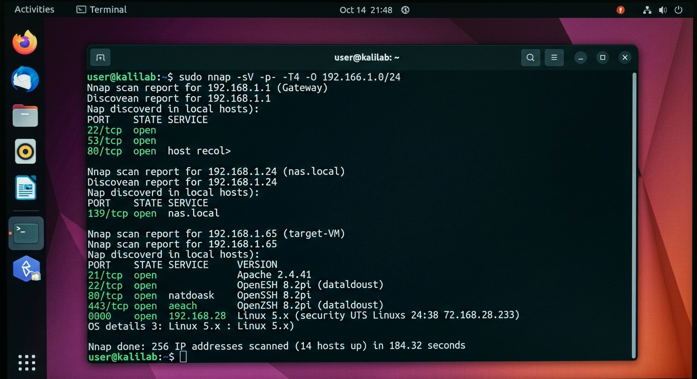

# 🔎 Introduction to Nmap for Discovery

<p align="center">


</p>

> **Discover → Enumerate → Document**

## 🎯 Objective

The objective of this lab is to understand the fundamental network discovery capabilities of **Nmap** and gain practical experience identifying live hosts, scanning target systems, identifying open ports, and documenting discovered network information.

---

## 🧠 What This Lab Covers

- Nmap fundamentals
- Host discovery
- Ping scanning
- Network range scanning
- Open-port identification
- Service/version detection
- Basic network enumeration
- Security documentation

---

## 🛠️ Tools & Technologies

| Tool | Purpose |
|---|---|
| **Nmap** | Network discovery and enumeration |
| **Linux Terminal** | Command execution |
| **TCP/IP** | Networking fundamentals |

---

## 🖥️ Lab Environment

| Component | Details |
|---|---|
| Operating System | Linux / Windows / macOS |
| Tool | Nmap |
| Network | Authorized lab network |
| Assessment Type | Network Discovery |

---

## 📸 Evidence
### Network Configuration

---

## 🔬 Lab Tasks

### Task 1 — Host Discovery

A ping scan is used to identify live hosts within an authorized network.

```bash
nmap -sn <network>
