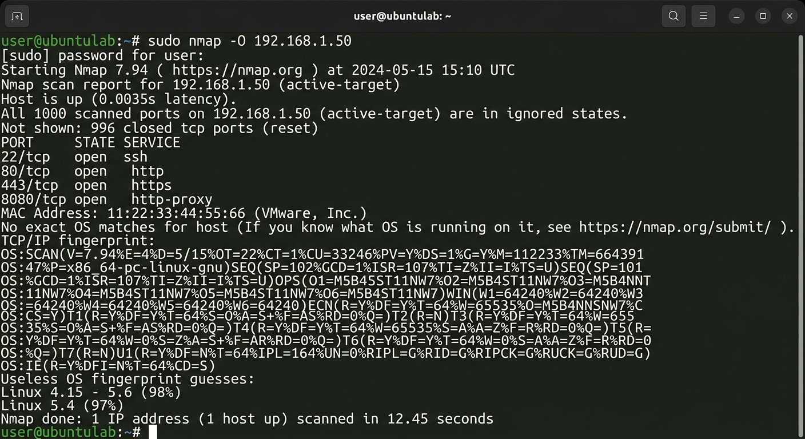

# 🔎 OS Fingerprinting

## 📌 Overview

OS Fingerprinting is a network reconnaissance technique used to identify the probable operating system running on a target host.

In this lab, Nmap was used to perform OS detection against an authorized target system. The results were analyzed to understand how OS fingerprinting works, its usefulness during security assessments, and its limitations.

---

## 🎯 Objectives

- Understand the concept of OS Fingerprinting.
- Learn how Nmap performs OS detection.
- Perform an OS detection scan using Nmap.
- Analyze the fingerprinting results.
- Understand the reliability and limitations of OS detection.
- Identify factors that can cause inaccurate results.

---

## 🛠️ Tools Used

- Ubuntu Linux
- Nmap
- Terminal

---

## 🌐 Network Configuration

The system's network configuration was checked before performing the assessment.

## 📸 Screenshot

	
---

## 🔬 Methodology

The assessment followed these steps:

1. Checked the local IP configuration.
2. Identified the authorized target IP address.
3. Verified connectivity with the target.
4. Performed Nmap OS detection.
5. Analyzed the detected operating system.
6. Compared the result with the known target OS where possible.
7. Documented the findings and limitations.

---

## 🔍 OS Detection

The primary command used was:

```bash
sudo nmap -O <target_ip>
