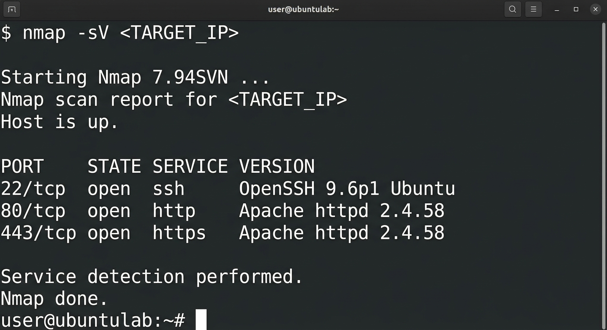

---

# `findings.md`

```markdown
# Findings

## Assessment Summary

Service and version detection was performed against the authorized target using Nmap.

## Detected Services

| Port | State | Service | Version |
|------|-------|---------|---------|
| XX/tcp | open | SERVICE | VERSION |
| XX/tcp | open | SERVICE | VERSION |

> Replace the placeholder values with the actual Nmap results.

## Observations

The scan identified network services exposed by the target system.

The following information was reviewed:

- Open ports
- Running services
- Detected software
- Software versions
- Potentially outdated services

## Security Assessment

Exposed services should be reviewed to determine whether they are required and securely configured.

Detected software versions should be checked against appropriate vendor security advisories and vulnerability databases.

## Evidence



## Overall Finding

The scan successfully identified services and their reported versions on the target system. Further vulnerability assessment may be required for outdated, unnecessary, or improperly configured services.
